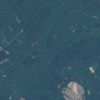
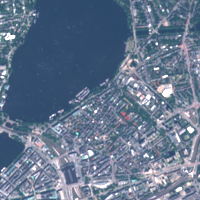
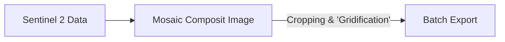
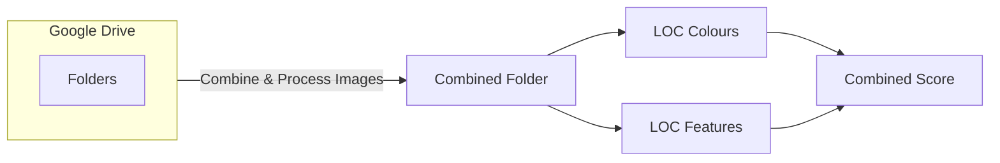
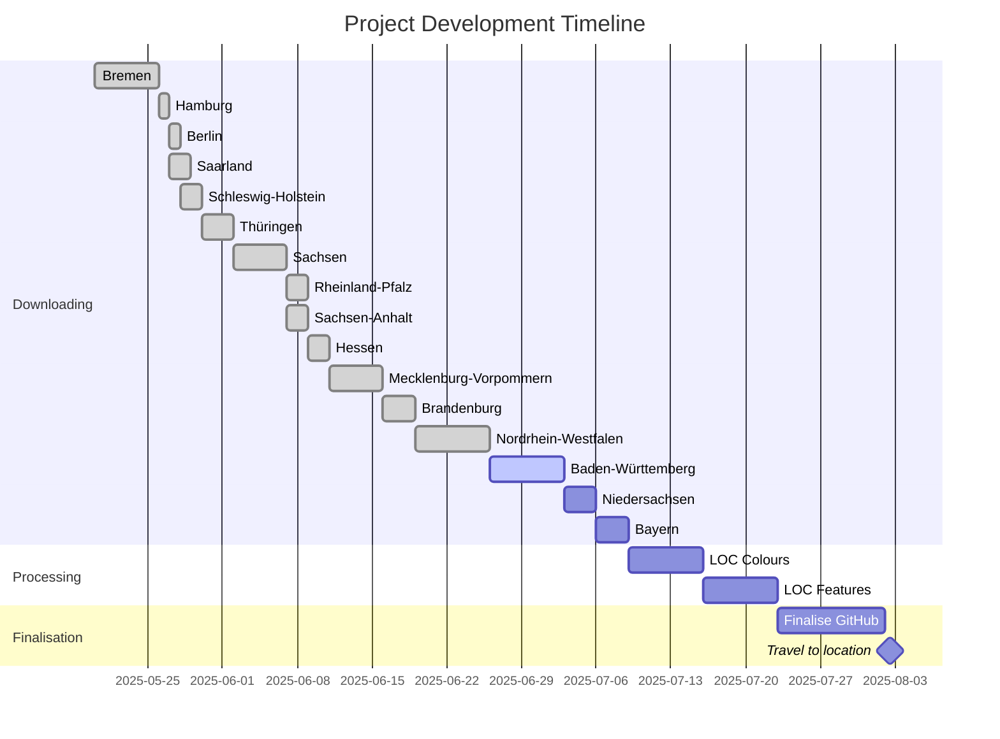
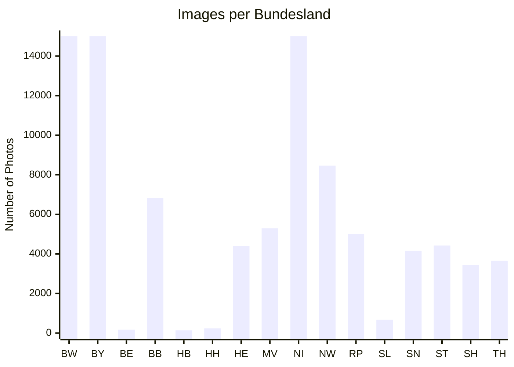

# 🛰️ Landsat Anomaly Hunter
> Discovering Germany's most visually unique landscapes, one square kilometer at a time

*What if we could automatically find the most interesting places in Germany just by looking at satellite data? This project does exactly that.*

This is a question I've started asking myslef while I was writing my Master's thesis on the changing landscape of the Nile river basin using remote sensing. Once I graduated and was writing job applications I started this project to relax and do something I truly love: use data science and programming to answer questions no one has ever asked. I've lived in Germany, England and Belgium and I have to say Germany is by far the most interesting in terms of landscape, especially Bavaria where I was born. But can I actually proof it? Everyone is always annoyed with me raving on about how great Bavaria is compared to the rest of Germany. This project is for all the people who doubt that, it provides cold hard facts to these mundane questions.

---

## 📋 Table of Contents
- [📊 Project Stats](#-project-stats)
- [➡️ General Workflow](#general-workflow)
- [📈 Progress](#-progress)
- [🏆 Most Interesting Discoveries](#-most-interesting-discoveries)
- [🚀 Quick Start](#-quick-start)
- [🔬 Technical Details](#-technical-details)
- [🤝 Contributing](#-contributing)
- [📝 Citation](#-citation)

---

## 📊 Project Stats
- **55,000+** satellite image squares processed
- **13** German states covered  
- **30+ days** of work


| Boring Squares | 🆚 | Interesting Squares |
|:---:|:---:|:---:|
|  | |  |


<details>
<summary>🔍 more details about the example squares</summary>

### Saarland proof of concept
| Tile Name | Pattern Score | Colour Score | Overall Score |
|:---:|:---:|:---:|:---:|
| tile_6.840_49.596 [*boring*] | 0.06888652 [639th] | 0.12536496 [150th] | 0.09712574 [545th] |
| tile_9.996_53.550 [*interesting*] | 0.94206405 [2nd] | 0.57256913 [8th] | 0.7573166 [1st] |

- Out of the 679 tiles analysed for Saarland these two have been used as an example.
- Saarland was the first test run of the LOF algorithm.
- It is not representative of the whole project yet as the data will still need to be cleand more since there's cloud coverage, broken data, missing tiles, and possibly many more problems.
- Additionally, the tiles were only compared against each other within Saarland which will skew the values compared to the final results.
- The tiles are named based on the LAT LON coordinates of the lower left corner so they can be found after the project is done and a higher res image can be created.
</details>


## 🏆 Most Interesting Discoveries [**TBD**]

### 🥇 Top Find: [**TBD**]

*LOF Score: [**TBD**] | Coordinates: [**TBD**]

### 🥈 Runner-up: [**TBD**]

*LOF Score: [**TBD**] | Coordinates: [**TBD**]

### 🍍 Most Boring: [**TBD**]

*LOF Score: [**TBD**] | Coordinates: [**TBD**]

<details>
<summary>🔬 Technical Implementation Details</summary>

## Feature Engineering
```python
def extract_features(image_square):
    # Structure features
    edges = cv2.Canny(image, 50, 150)
    texture = local_binary_pattern(image)
    
    # Color features  
    color_hist = cv2.calcHist([image], [0,1,2], None, [8,8,8], [0,256,0,256,0,256])
    saturation_var = np.var(cv2.cvtColor(image, cv2.COLOR_RGB2HSV)[:,:,1])
    
    return np.concatenate([edges.flatten(), texture.flatten(), color_hist.flatten(), [saturation_var]])
```
</details>

# General Workflow

I am fully aware these are not proper workflows. Since this a project just for me and I'm not planning on publishing any of it it is merely a representation of the process and I am not planning on doing proper UML diagrams as the procedure is rather simple.

The chart below describes the first and rather time intensive process of getting all the images downloaded.
A few things to note:

 - I'm working with the free versions of GEE and Collab meaning I'm heavily restricted by quotas. Accounting for this the mosaic image is split up into the 16 German Bundesländer and each of them is being processed on its own. 
	 - Collab times out after ten to twelve hours so a .json progress file is created on my Google Drive in order to continue where I left of because I don't trust Collab and its runtime to not mess up. 
	 - All the images are being exported in batches in order to minimize the risk of GEE complaining about export quotas.



 The chart below describes the  second part of the process. Since this step has not been reached yet  there's no way of telling how much time this will take. Initial testing suggests however that it should be quicker than the downloading of the images. A few considerations:
 - The images have been exported as .tif files meaning they have to be converted to .png files.
 - While steps were taken to filter for usable images there will be dirty data which needs to be processed
	 - Too much cloud coverage will be discarded
	 - broken satellite imagery will be discarded
	 - more than 50% of the square is located outside Germany will be discarded
- After processing the images will be stored in a combined folder in order to make further progress easier
- A square will receive a Feature & Colour Value based on its outlier factor which are weighed equally and a combined score is created. For a detailed explanation of the LOC and general procedure please refer to the methodology section.
-  

## Progress



## Data Collected



