## 📋 Table of Contents
- [🏆 Most Interesting Discoveries](#-most-interesting-discoveries)
- [➡️ General Workflow](#general-workflow)
- [📈 Progress](#-progress)
- [🔬 Methodology](#-methodology)

---

# 🛰️ Landsat Anomaly Hunter
> Discovering Germany's most visually unique landscapes, one square kilometer at a time

*What if we could automatically find the most interesting places in Germany just by looking at satellite data? This project does exactly that.*

This is a question I've started asking myslef while I was writing my Master's thesis on the changing landscape of the Nile river basin using remote sensing. Once I graduated and was writing job applications I started this project to relax and do something I truly love: use data science and programming to answer questions no one has ever asked. I've lived in Germany, England and Belgium and I have to say Germany is by far the most interesting in terms of landscape, especially Bavaria where I was born. But can I actually proof it? Everyone is always annoyed with me raving on about how great Bavaria is compared to the rest of Germany. This project is for all the people who doubt that, it provides cold hard facts to these mundane questions.

---

## 📊 Project Stats
- **70,000+** satellite images downloaded & processed
- **16** German states covered  
- **50+ days** of work

---

| Boring Squares | 🆚 | Interesting Squares |
|:---:|:---:|:---:|
|  | |  |


<details>
<summary>🔍 more details about the example squares</summary>

### Saarland proof of concept
| Tile Name | Pattern Score | Colour Score | Overall Score |
|:---:|:---:|:---:|:---:|
| tile_6.840_49.596 [*boring*] | 0.06888652 [639th] | 0.12536496 [150th] | 0.09712574 [545th] |
| tile_9.996_53.550 [*interesting*] | 0.94206405 [2nd] | 0.57256913 [8th] | 0.7573166 [1st] |

- Out of the 679 tiles analysed for Saarland these two have been used as an example.
- Saarland was the first test run of the LOF algorithm.
- It is not representative of the whole project yet as the data will still need to be cleand more since there's cloud coverage, broken data, missing tiles, and possibly many more problems.
- Additionally, the tiles were only compared against each other within Saarland which will skew the values compared to the final results.
- The tiles are named based on the LAT LON coordinates of the lower left corner so they can be found after the project is done and a higher res image can be created.
</details>

---

## 🏆 Most Interesting Discoveries
- [🟨 Best Scores Overall](##-best-scores-overall)
- [🟪 Best Colour Scores & 🟩 Best Feature Scores](##best-colour-Scores-&-best-feature-scores)


| 🥇 Top Find: Walchensee [Bayern] | 🥈 Runner-up: Wattmeer [Schleswig-Holstein] | 🍍 Most Boring: Gutsbezirk Spessart [Hessen] |
|:---:|:---:|:---:|
|  |  |  |
| LOF Score: [0.6688657285] | LOF Score: [0.590112165] | [0.006251266358] |
| [47.595Lat 11.341Lon] | [54.434Lat 8.445Lon] | [50.228Lat 9.365Lon]|


---
## 🟨 Best Scores Overall
---
 

$${\color{#8B7F13}\mathbf{This\ is\ bold\ gold\ text}}$$
$${\color{#247356}\mathbf{This\ is\ bold\ green\ text}}$$
$${\color{#7524AC}\mathbf{This\ is\ bold\ purple\ text}}$$


| 1️⃣ $${\color{#8B7F13}\mathbf{Walchensee}}$$ | 2️⃣ $${\color{#8B7F13}\mathbf{Süderoogsand}}$$ | 3️⃣ $${\color{#8B7F13}\mathbf{Tagebau\ Welzow-Süd}}$$  |
|:---:|:---:|:---:|
|  |  |  |
| LOF Score: [0.6688657285] | LOF Score: [0.590112165] | LOF Score: [0.57239852] |
| [47.595Lat 11.341Lon] | [54.434Lat 8.445Lon] | [51.567Lat 14.225Lon]|
| 4️⃣ $${\color{#8B7F13}\mathbf{Hindenburgdamm}}$$ | 5️⃣ $${\color{#8B7F13}\mathbf{Süderoogsand}}$$ | 6️⃣ $${\color{#8B7F13}\mathbf{Tagebau\ Nochten}}$$  |
| 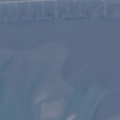 | 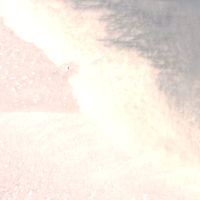 | 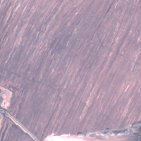 |
| LOF Score: [0.5551107299] | LOF Score: [0.5544834481] | LOF Score: [0.5258437379] |
| [54.866Lat 8.532Lon] | [54.435Lat 8.476Lon] | [51.48Lat 14.561Lon]|
| 7️⃣ $${\color{#8B7F13}\mathbf{Saaler\ Bodden}}$$  | 8️⃣ $${\color{#8B7F13}\mathbf{Totalreservat\ Wannichen}}$$  | 9️⃣ $${\color{#8B7F13}\mathbf{Hirschhorn}}$$ |
| 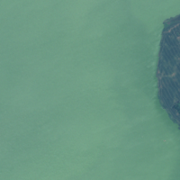 | 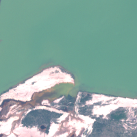 | 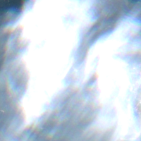 |
| LOF Score: [0.5157419855] | LOF Score: [0.5128397034] | LOF Score: [0.5082391195] |
| [54.314Lat 12.444Lon] | [51.784Lat 13.785Lon] | [49.455Lat 8.917Lon]| 
| 🔟 $${\color{#8B7F13}\mathbf{Braunkohle-Tagebau\ Hambach}}$$  |  | |
|  | | |
| LOF Score: [0.5053973746] | | |
| [50.903Lat 6.496Lon] | | |

## 🟪 Best Colour Scores & 🟩 Best Feature Scores

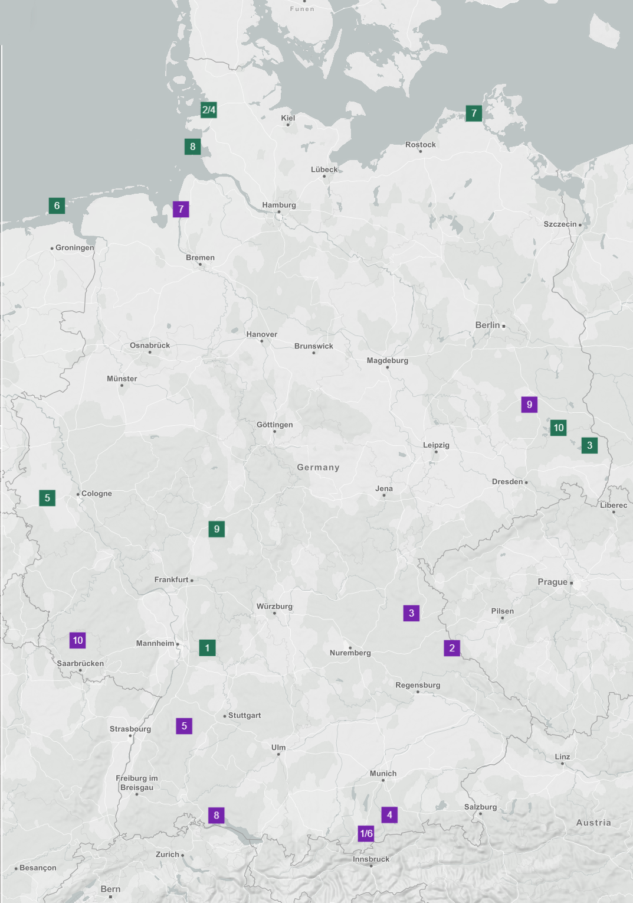 


| 1️⃣ $${\color{#7524AC}\mathbf{Walchensee}}$$ | 2️⃣ $${\color{#7524AC}\mathbf{Tiefenbach}}$$ | 3️⃣ $${\color{#7524AC}\mathbf{Pressath}}$$  |
|:---:|:---:|:---:|
|  | 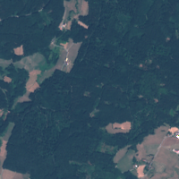 | 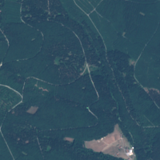 |
| LOF Score: [1] | LOF Score: [0.6674969813] | LOF Score: [0.5601663615] |
| [47.595Lat 11.341Lon] | [49.451Lat 12.615Lon] | [49.793Lat 12.001Lon]|
| 4️⃣ $${\color{#7524AC}\mathbf{Waalkirchen}}$$ | 5️⃣ $${\color{#7524AC}\mathbf{Neuweiler}}$$ | 6️⃣ $${\color{#7524AC}\mathbf{Walchensee}}$$  |
| 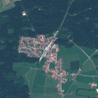 | 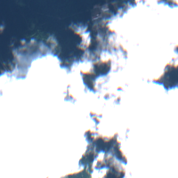 | 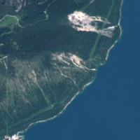 |
| LOF Score: [0.5566178204] | LOF Score: [0.5380550166] | LOF Score: [0.5149599051] |
| [47.786Lat 11.67Lon] | [48.68Lat 8.565Lon] | [47.596Lat 11.315Lon]|
| 7️⃣ $${\color{#7524AC}\mathbf{Bremerhafen}}$$  | 8️⃣ $${\color{#7524AC}\mathbf{Obersee}}$$  | 9️⃣ $${\color{#7524AC}\mathbf{Schlabendorfer\ See}}$$ |
| 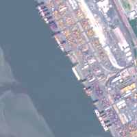 | 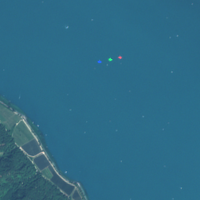 |  |
| LOF Score: [0.5052467851] | LOF Score: [0.4934236052] | LOF Score: [0.4787055813] |
| [53.572Lat 8.517Lon] | [47.781Lat 9.053Lon] | [51.784Lat 13.785Lon]| 
| 🔟 $${\color{#7524AC}\mathbf{Primstal}}$$  |  | |
| 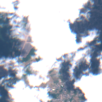 | | |
| LOF Score: [0.4669615026] | | |
| [49.527Lat 6.954Lon] | | |


| 1️⃣ $${\color{#247356}\mathbf{Hirschhorn}}$$ | 2️⃣ $${\color{#247356}\mathbf{Hussum}}$$ | 3️⃣ $${\color{#247356}\mathbf{Tagebau\ Reichwalde}}$$  |
|:---:|:---:|:---:|
|  | 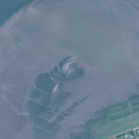 | 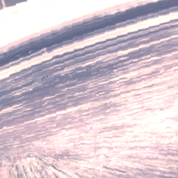 |
| LOF Score: [1] | LOF Score: [0.9322604098] | LOF Score: [0.8944784921] |
| [49.455Lat 8.917Lon] | [54.454Lat 8.938Lon] | [51.401Lat 14.695Lon]|
| 4️⃣ $${\color{#247356}\mathbf{Süderoogsand}}$$ | 5️⃣ $${\color{#247356}\mathbf{Braunkohle-Tagebau\ Hambach}}$$ | 6️⃣ $${\color{#247356}\mathbf{Borkum}}$$  |
|  | 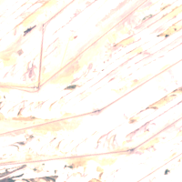 | 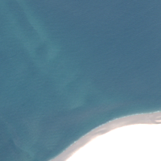 |
| LOF Score: [0.8827409585] | LOF Score: [0.882369035] | LOF Score: [0.8721131613] |
| [54.434Lat 8.445Lon] | [50.903Lat 6.496Lon] | [53.604Lat 6.641Lon]|
| 7️⃣ $${\color{#247356}\mathbf{Groß Mohrdorf}}$$  | 8️⃣ $${\color{#247356}\mathbf{Wattmeer}}$$  | 9️⃣ $${\color{#247356}\mathbf{Ilsdorf-Solms\ See}}$$ |
| 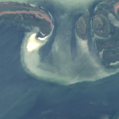 | 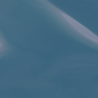 |  |
| LOF Score: [0.8517181201] | LOF Score: [0.845703025] | LOF Score: [0.8421609745] |
| [54.424Lat 12.947Lon] | [54.13Lat 8.694Lon] | [50.606Lat 9.057Lon]| 
| 🔟 $${\color{#247356}\mathbf{Tagebau\ Welzow-Süd}}$$  |  | |
| 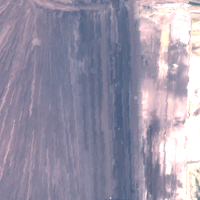 | | |
| LOF Score: [0.8345225538] | | |
| [51.567Lat 14.225Lon] | | |


---

## ➡️ General Workflow

I am fully aware these are not proper workflows. Since this a project just for me and I'm not planning on publishing any of it it is merely a representation of the process and I am not planning on doing proper UML diagrams as the procedure is rather simple.

The chart below describes the first and rather time intensive process of getting all the images downloaded.
A few things to note:

 - I'm working with the free versions of GEE and Collab meaning I'm heavily restricted by quotas. Accounting for this the mosaic image is split up into the 16 German Bundesländer and each of them is being processed on its own. 
	 - Collab times out after ten to twelve hours so a .json progress file is created on my Google Drive in order to continue where I left of because I don't trust Collab and its runtime to not mess up. 
	 - All the images are being exported in batches in order to minimize the risk of GEE complaining about export quotas.


 The chart below describes the  second part of the process. Since this step has not been reached yet  there's no way of telling how much time this will take. Initial testing suggests however that it should be quicker than the downloading of the images. A few considerations:
 - The images have been exported as .tif files meaning they have to be converted to .png files.
 - While steps were taken to filter for usable images there will be dirty data which needs to be processed
	 - Too much cloud coverage will be discarded
	 - broken satellite imagery will be discarded
	 - more than 50% of the square is located outside Germany will be discarded
- After processing the images will be stored in a combined folder in order to make further progress easier
- A square will receive a Feature & Colour Value based on its outlier factor which are weighed equally and a combined score is created. For a detailed explanation of the LOC and general procedure please refer to the methodology section.
  


---

## 📈 Progress

Starting this project in May 2025 I was assuming it would take a while to finish but since it was a side project I didn't mind too much. However, as it turns out Germany is not a small country and with the limited resources available it is taking a bit longer than expected. That being said, progress has been made and is steady. 

After a bit of trial and error with GEE quota limits a routine was developed which is: wake up, turn on the laptop, start the code, live my life, turn of the laptop, go to sleep. 

Using Google Collab might be slower as I can only go one step at a time, there is time outs, and it is in gerneral not as stable as if I did it on my local machine but it has one big advantage: My laptop is not catching on fire. Essentially, I can just leave the code running in the backround as long as I have my browser open (which is pretty much always the case since I'm applying for jobs at the moment) and it is a lot less intensive on my machine than if I were to run the script locally.

Below is a timeline of the project and how far I've gotten so far. Important to note: While there is a progress .json file as a failsafe it does not include the timestamps for each export, hence the progress can not be tracked on an hourly basis. The decision to put everything on GitHub and create this readme was an afterthought as my initial idea was to just have this as a side project. My partner convinced me to put it on mny resume as well so here we are now. If I were to do similar projects in the future I would definitely include a .json progress  file that tracks the time as well in oder to get a more acurate picture of the progress.


### Data Collected

As stated in the section above, progress was slow to begin with but ramped up significantly one a daily routine was established. 

The charts below describe the overall progress made in tiles captured as well as a chart describing the amount of tiles per German state. **[Rheinland-Pflanz is suspisious with exactly 5k... Need to double check]**

In future projects I would definitely go the route I did for the cumulative progress, meaning create a GitHub workflow and have a progress.csv file in the repo. Initially I didn't do this as I was just working in Collab and Google Drive, so right now I have to update the progress file manually which is a pain. Furthermore, it would just make more sense to have the timeline shown above and the images per Bundesland tied to the data/ progress itself and have them update automatically. As previously mentioned this gitHub page was an afterthought. Lesson learned.  


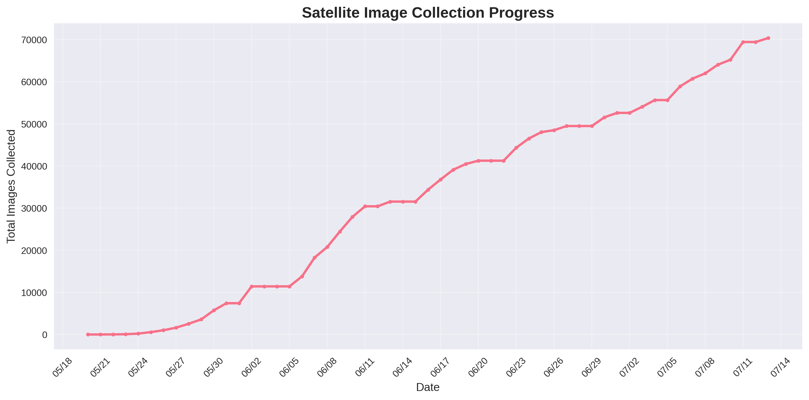


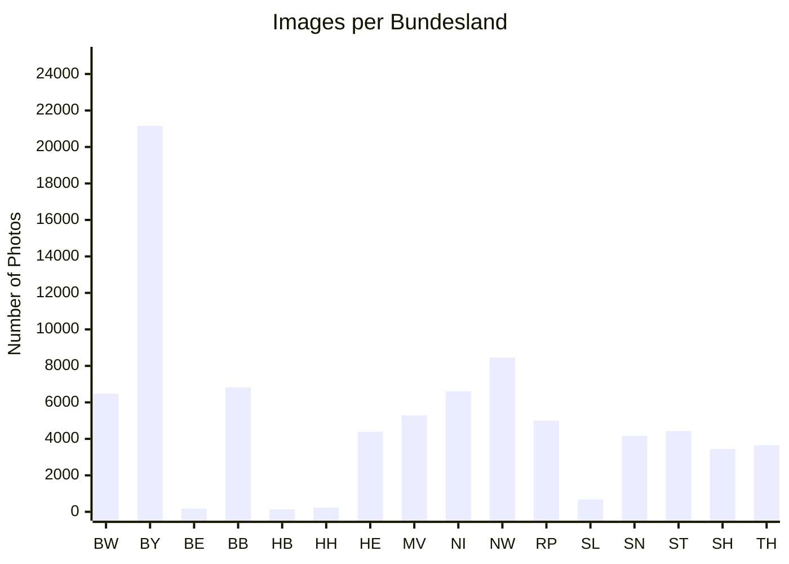

---

## 🔬 Methodology

**[TBD]**


| Header 1          | Header 2          |
| :---------------- | :---------------- |
| Normal text       | <span style="color: blue;">Blue text cell</span> |
| <span style="color: red;">Red text cell</span> | Another cell      |

```diff
- This line is red (like a deletion).
+ This line is green (like an addition).
! This line is orange (like a warning).
# This line is gray (like a comment).
@@ This line is purple and bold (like a section header). @@
```


$${\color{red}This\ is\ red\ text}$$$${\color{blue}This\ is\ blue\ text}$$$${\color{#FF8C00}This\ is\ orange\ text}$$


> [!NOTE]
> This is a note, typically blue.

> [!TIP]
> This is a tip, typically green.

> [!IMPORTANT]
> This is important information, typically blue/purple.

> [!WARNING]
> This is a warning, typically yellow/orange.

> [!CAUTION]
> This is a caution, typically red.


|  | Header 2 |
|---|---|
| Normal text |  |


| Header 1          | Header 2          |
| :---------------- | :---------------- |
| Normal text       | <span style="color: blue;">Blue text cell</span> |
| <span style="color: red;">Red text cell</span> | Another cell      |
